# 课堂视频 PPT 自动提取项目复盘报告

**复盘日期：** 2026-07-29  
**最近更新：** 2026-07-30 23:55
**项目目录：** `E:\leeson`  
**当前主方案：** 增量流式时间连续性检测算法  
**保留对照方案：** FFmpeg 场景阈值算法
**算法正式版本：** v1.4.0（已同步到项目根目录）  
**新版桌面端版本：** 课析 v2.0.0  
**发布一致性状态：** 已同步并重新打包，安装包 565 MB

---

## 一、项目目标

项目要解决的问题是：输入一段课堂录屏，自动识别其中展示的PPT页面，
提取逐页讲话，并评估讲话与PPT的关联程度，输出：

- 每一页的代表截图；
- 每一页在视频中的开始时间和结束时间；
- 换页置信度和可复核记录；
- 机器可读的 `result.json`；
- 每页展示期间的讲话文字；
- PPT截图与讲话内容的逐页关联度分数和理由；
- 尽量减少不同视频反复人工调参。

项目最初依据 PRD 采用 FFmpeg 场景突变检测，随后在多段真实视频上暴露出阈值依赖和同模板页面漏检问题，因此演进为当前的时间连续性检测方案。

## 二、当前处理流程

```mermaid
flowchart LR
    A["输入课堂视频"] --> B["读取时长和1080p源分辨率"]
    B --> C["自动定位投影区域"]
    C --> D["按视频块每2秒提取低分辨率分析帧"]
    D --> E["4×3分块感知哈希比较"]
    E --> F["确认变化是否持续约10秒"]
    F --> G["合并文字相同但位置变化的动画状态"]
    G --> H["保留最后两个仍可能变化的候选段"]
    H --> I["确认更早的稳定页面"]
    I --> J["以0.25秒精度细化换页时间"]
    J --> K["选择代表帧并重新提取高清截图"]
    K --> L{"选择语音引擎"}
    L -->|"本地Whisper"| M["整段视频转写后按页面时间归类"]
    L -->|"小米MiMo"| N["页面确认后立即提取临时音频并分段ASR"]
    N --> O["该页文字返回后立即提交LLM评分"]
    M --> P["逐页发送截图和纯讲话文字给多模态LLM"]
    O --> Q["实时显示逐页结果"]
    P --> Q
    Q --> R["输出截图、时间轴、转写、评分和总报告"]
```



核心设计思想是将“分析”和“输出”分开：

- 分析阶段使用较小画面，保证速度；
- 输出阶段回到原视频，保证截图清晰度；
- 换页必须形成持续稳定的新状态，避免仅依靠单帧突变；
- 代表帧优先选择同一页面中信息增量较大的状态；
- 流式版不改变页面判定规则，只把稳定页面更早交给ASR和LLM；
- ASR与LLM共享最多5个云端请求，避免两类请求叠加造成限流。

## 三、问题与解决方法总览

| 编号 | 遇到的问题 | 根因 | 解决方法 | 当前状态 |
|---:|---|---|---|---|
| 1 | 不清楚人工标注的作用 | 自动检测缺少客观真值 | 明确人工标注只用于验收和评估，不参与日常自动处理 | 已明确 |
| 2 | 缺少可直接操作的界面 | 初版偏命令行，不便使用 | 为新算法建立独立 GUI | 已解决 |
| 3 | FFmpeg 未全局安装 | 系统找不到 `ffmpeg/ffprobe` | 管理员安装到 Program Files，并加入机器 PATH | 已解决 |
| 4 | 已下载 FFmpeg，但程序仍不能直接使用 | 压缩包目录未进入系统环境 | 增加本地安装脚本，复制已下载版本并验证 | 已解决 |
| 5 | `3333.mp4` 约20分钟只输出极少图片 | 场景阈值和去重规则过于严格 | 多阈值、裁剪区域和算法诊断 | 促成算法升级 |
| 6 | `123.mp4` 换一个视频后效果仍不稳定 | 固定阈值和固定区域不能跨视频泛化 | 从场景突变法切换为时间连续性检测 | 已改善 |
| 7 | 旧算法需要不断调参数 | 不同视频的转场速度、模板、曝光差异很大 | 引入持续采样、稳定确认和自动投影区识别 | 主方案已替换 |
| 8 | 教师走动、遮挡和书写可能触发变化 | 单帧变化不等于真实换页 | 分块判断、多帧稳定确认、最短页面时长 | 已缓解 |
| 9 | 最终截图看起来不是1080p | 分析帧低分辨率被误用于输出 | 分析用低分辨率，最终从源视频重新解码 | 已解决 |
| 10 | 截图尺寸小于1920×1080 | 输出只保留投影区域 | 保持原像素密度，只做裁剪、不做低清缩放 | 已解释并保留 |
| 11 | 新旧两种算法混在一起，代码臃肿 | 历史流程与当前流程耦合 | 旧算法迁入独立文件夹，主程序删除旧流程 | 已解决 |
| 12 | 新算法参数不易理解 | 参数只有内部名称 | GUI 增加中文名称、单位、默认值和影响说明 | 已解决 |
| 13 | 旧算法没有独立 GUI | 归档后仍需对照和测试 | 为旧算法建立单独 GUI 和启动脚本 | 已解决 |
| 14 | `444.mp4` 旧算法只输出4页 | 全局 pHash 把同模板不同正文当成重复页 | 全局相似度与分块变化比例联合去重 | 优化后23页 |
| 15 | 旧算法裁掉标题、截图分辨率低 | 固定裁剪和低清候选帧直接输出 | 自动投影区识别，并重新提取高清代表帧 | 已解决 |
| 16 | `2222.mp4` 新算法只有9页，旧算法有12页 | 新算法仍把全局哈希差异设为硬门槛 | 取消全局哈希硬门槛，以持续稳定分块变化为准 | 优化后12页 |
| 17 | 担心取消全局门槛导致误检 | 检测条件变宽可能过度切分 | 保留稳定时长、分块比例、稳定性和最短时长，并用444回归 | 未发现本次引入的误检 |
| 18 | `444.mp4` 片头目录被分成两页 | 缩放动画持续形成两个稳定画面状态 | 后续增加位置无关的文字行内容签名，将同文字动画状态合并 | 已解决 |
| 19 | “低置信度”容易被理解为错误 | 当前置信度主要来自变化块比例 | 保留人工复核提示，后续应重新校准置信度 | 待优化 |
| 20 | 仍缺少统一、客观的准确率结论 | 目前主要依赖视觉抽查和算法互相比对 | 建议建设多视频人工标注基准集 | 待完成 |
| 21 | `29_16.mp4` 片头目录仍输出两份 | 目录动画重新排列相同文字，分块位置大面积变化 | 增加位置无关的文字行内容签名并合并同页动画 | 已解决 |
| 22 | 需要知道每页 PPT 展示期间讲了什么 | 页面时间轴和视频语音尚未关联 | 本地整段转写或云端按页转写，统一输出逐页讲话文字 | 已完成 |
| 23 | 45秒测试结果的第13、14页显示无讲话 | 测试片段错误套用了完整36分钟PPT时间轴 | 转写前强制校验视频与页面总时长，并重新处理完整视频 | 已解决 |
| 24 | 需要量化每页讲话和PPT的关联程度 | 只有截图和逐页文字，没有统一评价标准 | 使用OpenAI兼容多模态LLM逐页评分，默认返回分数和理由、证据可选 | 已完成并通过真实服务测试 |
| 25 | 三个处理阶段分散在不同GUI，使用门槛较高 | 用户需要在多个窗口间手动传递视频、result.json和transcript.json | 新建统一桌面应用并打包为包含FFmpeg和语音模型的Windows EXE | 已完成 |
| 26 | 设置用户级API Key后当前进程仍读不到 | `setx`只影响之后启动的新进程，已运行的Codex没有继承新环境 | 重启运行环境，并允许从用户级环境读取密钥；全过程不打印密钥 | 已解决 |
| 27 | 小米ASR处理超长页面时循环并截断结尾 | 单页4分54秒音频一次提交超过模型稳定处理区间 | 页面超过90秒自动分段，识别后按顺序合并回原PPT页 | 已解决 |
| 28 | 需要验证新算法、云端ASR和LLM是否能真正串联 | 之前各阶段主要分开测试 | 使用55分36秒的`444.mp4`重新跑24页完整链路 | 已完成 |
| 29 | LLM详细证据输出过长、消耗输出Token | 每页都返回关键点、证据列表、无关内容和置信度 | 默认只返回三个分项数字和理由，GUI开关按需启用详细证据 | 已解决 |
| 30 | 需要确认LLM究竟发送了哪些数据 | 图文请求边界不直观 | 明确每页独立发送当前截图Base64和纯讲话文字，不发送视频、音频、时间戳或其他页面 | 已明确并导出完整请求样例 |
| 31 | 版本迭代后缺少统一回退和远端记录 | 本地功能、EXE和Git状态容易不一致 | 建立v1.0.0～v1.2.0标签，发布包自检后推送GitHub | 已完成 |
| 32 | 测试密钥曾以明文输入终端和对话 | 临时联调需要快速验证真实服务，但明文暴露后不宜长期使用 | 测试后轮换密钥；程序只从GUI内存或环境变量读取，禁止写入源码、结果和Git | 已处理并形成安全约束 |
| 33 | PPT识别、ASR和LLM三个阶段顺序等待，前面完成的页面不能先处理 | 完整流程只在上一阶段全部结束后启动下一阶段 | 小米云端完整处理改为“确认一页→立即ASR→该页文字返回后立即评分”的逐页流水线 | 已完成 |
| 34 | 流水线首版真实测试反而变慢 | ASR并发3和LLM并发5直接叠加，同一云端服务同时承受最多8个请求，出现明显排队 | ASR和LLM共享统一云端并发额度，默认总上限5；保留逐页流水线但避免并发过载 | 已解决 |
| 35 | 想用FFmpeg场景阈值尽快确定时间段 | 阈值法候选快，但会重新引入漏页、误检和跨视频调参问题 | 建立双算法实验分支进行真实对照，最终不让两套检测器同时完整解码视频 | 已完成实验 |
| 36 | 逐页云端流水线仍要等待全视频时序分析完成 | 页面检测只有在整段低分辨率采样结束后才交付结果 | 将同一套时序算法改为按视频块增量确认，只保留最后两个不稳定候选段 | v1.4.0正式方案 |
| 37 | 原Tkinter桌面端功能可用但界面过于简陋 | 界面以表单和按钮为主，缺少任务导航、页面状态与结果检查工作台 | 参考已确认的视觉稿，新建Tauri 2 + React + TypeScript桌面端“课析” | 已完成 |
| 38 | 本机最初缺少Tauri构建环境 | 缺少Rust工具链、MSVC链接器和Windows SDK | 安装Rust stable、Visual Studio Build Tools和Windows SDK，复用已有WebView2与Node.js | 已解决 |
| 39 | Rust官方下载长时间停滞 | 官方分发节点在当前网络环境不稳定 | 使用可信镜像完成Rust工具链安装，之后通过MSVC环境编译 | 已解决 |
| 40 | Python处理引擎的中文输出出现乱码风险 | 打包后标准输入输出编码不一定默认为UTF-8 | Worker启动时显式将stdin/stdout配置为UTF-8并使用JSON Lines通信 | 已解决 |
| 41 | Tauri资源映射首次会压平PyInstaller目录 | Worker依赖的`_internal`目录结构不能被破坏 | 将完整PyInstaller目录映射为Tauri的`worker`资源目录 | 已解决 |
| 42 | 安装包封装耗时较长且体积较大 | 发布包包含本地语音识别环境和模型 | 保留可离线处理能力，采用NSIS压缩；最终安装包约641MB | 已完成 |
| 43 | 桌面端版本与算法内核版本可能混淆 | UI版本、Python包版本和发布快照没有同步推进 | 分别记录桌面端2.0.0与算法1.4.0，并增加发布前版本一致性检查 | 待完成同步 |

## 四、各阶段详细复盘

### 阶段1：依据 PRD 建立初版 FFmpeg 场景检测

最初方案的流程是：

1. 使用 FFmpeg `scene` 滤镜寻找画面突变候选点；
2. 对候选点前后画面进行分块 pHash 比较；
3. 寻找候选点之后的稳定帧；
4. 使用全局 pHash 去除重复页面；
5. 合并停留时间过短的页面；
6. 输出代表截图、时间戳和候选审计数据。

这一阶段完成了基础命令行、配置文件、JSON 输出、测试框架和验收入口。

#### 关于人工标注

人工标注不是程序运行所必需的步骤，其作用是建立“正确答案”：

- 人工记录真实换页时间；
- 标记哪些变化是动画、教师遮挡或书写；
- 将程序结果与人工结果对比；
- 计算召回率、误判率和时间戳误差。

没有人工标注时，可以判断“看起来好不好”，但无法客观证明算法达到了多少准确率。

### 阶段2：建立 GUI 和运行环境

为了让程序不依赖命令行操作，为当前算法建立了 GUI，包含：

- 视频选择；
- 输出目录选择；
- 参数设置；
- FFmpeg 与 FFprobe 路径；
- 处理进度和日志；
- 页面开始、结束时间和置信度列表；
- 双击打开截图；
- 打开输出目录和结果 JSON。

随后又为归档的旧算法建立了完全独立的 GUI。

#### FFmpeg 安装问题

系统最初没有可全局调用的 FFmpeg。用户已下载：

`E:\迅雷云盘\ffmpeg-8.1.2-essentials_build\ffmpeg-8.1.2-essentials_build`

最终处理方式：

- 使用管理员权限；
- 复制到 `C:\Program Files\FFmpeg`；
- 将 `C:\Program Files\FFmpeg\bin` 加入机器 PATH；
- 分别验证 `ffmpeg.exe` 和 `ffprobe.exe`；
- 保留在线安装脚本和本地已下载版本安装脚本。

当前验证版本为：

- FFmpeg `8.1.2-essentials_build`
- FFprobe `8.1.2-essentials_build`

### 阶段3：真实视频暴露固定阈值问题

#### `3333.mp4`

第一次实际处理约20分钟的视频时，只得到极少截图，明显漏检。

诊断发现：

- 提高场景阈值会漏掉柔和转场；
- 降低阈值会得到更多候选，但同时增加人物、书写和曝光变化；
- 使用 `scene_threshold=0.05` 的诊断结果可以达到约13页；
- 说明视频中并非没有变化，而是固定阈值没有稳定覆盖这些变化。

#### `123.mp4`

更换视频后效果仍然不稳定。不同裁剪区域的诊断结果曾在7页和17页之间变化，进一步证明：

- 画面中的投影区域位置会影响结果；
- 教师、墙面、黑边和讲台会改变全局相似度；
- 一组固定阈值不能可靠适配所有视频。

这一阶段得到的关键结论是：继续逐视频调 FFmpeg 场景阈值，可以改善单个样本，但无法满足“自动化 + 精准”的目标。

### 阶段4：从场景突变法升级为时间连续性算法

用户提出的核心想法是：

> 定期取图并比较相似度，直到出现完全不同且持续的新画面；在同一页面区间内，选取与第一张仍相似、但信息差异最大的图片，并记录这一页的开始与结束时间。

最终实现对这一想法进行了工程化调整：

- 没有直接使用10秒采样，因为可能漏掉停留时间较短的页面；
- 默认改为每2秒取一张分析帧；
- 对投影区域划分为4×3网格；
- 每个分块计算感知哈希；
- 新状态需要持续约10秒才确认；
- 以4 fps回查换页附近画面，将时间精度提高到约0.25秒；
- 在每个稳定页面区间中选择信息增量较大的代表帧。

相较旧算法，新算法不再要求换页瞬间必须产生强烈的 FFmpeg 场景分数，因此对渐变、同模板换正文和课堂书写视频更普遍适用。

但“普遍适用”并不代表完全无参数。采样间隔、确认时长、变化比例和最短页面时长仍决定“短页面召回”和“动画过滤”之间的平衡。

### 阶段5：解决截图清晰度问题

用户发现1080p视频提取出的图片看起来分辨率偏低。

根因是早期流程为了提高分析速度，使用了缩小后的分析帧，并直接将其用于输出。

修复后：

- 分析阶段仍使用约320×180的小图；
- 最终截图重新从原视频对应时间解码；
- JPEG质量默认90；
- 自动裁剪投影区后，图片尺寸可能小于1920×1080，但像素密度仍来自1080p源视频。

实际结果示例：

- `444.mp4` 源视频：1920×1080；
- 优化前旧算法截图：512×317；
- 优化后截图：1844×1026。

因此，“尺寸略小”来自裁剪掉非投影区域，不代表被降采样成低清图片。

### 阶段6：新旧算法拆分

为了避免旧场景阈值代码继续污染主程序，完成了结构拆分：

```text
E:\leeson\
├── video_page_detector\                 当前时间连续性算法
├── config\                              当前算法配置
├── tests\                               当前算法测试
├── 场景阈值方法\
│   ├── legacy_ffmpeg_scene_detector\    旧 FFmpeg 场景算法
│   ├── legacy_output\                   旧算法输出
│   └── 启动旧版FFmpeg方法GUI.bat
└── 启动GUI.bat                          当前算法入口
```

拆分后的原则：

- 当前 GUI 不再加载旧算法；
- 当前主代码不保留 FFmpeg `scene` 检测逻辑；
- 旧方法可以独立运行、独立配置、独立测试；
- 两种方法可以在同一视频上做对照实验。

### 阶段7：`444.mp4` 发现并优化旧算法

#### 优化前对比

`444.mp4` 信息：

- 时长：3336.362秒，约55分36秒；
- 分辨率：1920×1080。

| 指标 | 新算法当时结果 | 旧算法优化前 |
|---|---:|---:|
| 页面数 | 20 | 4 |
| 处理耗时 | 102.323秒 | 92.370秒 |
| 截图尺寸 | 1844×1026 | 512×317 |

旧算法实际找到了24个场景候选点，但有19个被全局 pHash 去重规则删除。

#### 根因

该视频使用统一的页眉、背景和版式。不同页面的全局 pHash 距离经常只有0、2、4或6，而旧算法规定距离不大于6就是重复页面。

因此，错误不在 FFmpeg 场景粗筛，而在后续“只看全局相似度”的去重策略。

#### 优化方法

重复页判断改为必须同时满足：

1. 全局 pHash 足够相似；
2. 内容变化的分块比例低于25%。

同时增加：

- 自动识别投影区域；
- 从原视频重新提取高清截图；
- 候选审计文件记录全局距离和分块变化比例。

#### 优化结果

| 指标 | 旧算法优化前 | 旧算法优化后 |
|---|---:|---:|
| 场景候选点 | 24 | 24 |
| 最终页面 | 4 | 23 |
| 被判为全局重复 | 19 | 0 |
| 处理耗时 | 92.370秒 | 98.545秒 |
| 截图尺寸 | 512×317 | 1844×1026 |

优化说明：旧算法的粗筛能力并不差，但仍然依赖不同视频的场景阈值，且容易受到渐变动画、教师移动和曝光变化影响。因此它被保留为对照方案，而不是重新成为主方案。

### 阶段8：`2222.mp4` 发现并优化新算法

#### 问题表现

| 方案 | 页面数 |
|---|---:|
| 新算法优化前 | 9 |
| 优化后旧算法 | 12 |

人工查看确认，新算法漏掉的三个页面是真实换页：

- 约400.23秒；
- 约568.50秒；
- 约1397.47秒。

这些页面具有共同特点：标题和模板相同，但正文例题或知识点已经更换。

#### 根因

新算法原来要求同时满足：

1. 稳定变化分块比例达到50%；
2. 全局 pHash 距离至少达到8。

三个漏检点的数据为：

| 时间 | 稳定变化分块比例 | 全局哈希距离 |
|---:|---:|---:|
| 约400.23秒 | 58.3% | 2 |
| 约568.50秒 | 66.7% | 2 |
| 约1397.47秒 | 75.0% | 6 |

正文已经大面积稳定改变，但统一模板让整张图的哈希距离仍然很低，因此被全局门槛拦截。

#### 修复方法

- 取消全局 pHash 距离的硬门槛；
- 以“持续稳定变化的分块比例”为主要换页条件；
- 全局哈希继续保留在诊断数据中；
- 继续保留约10秒确认、分块稳定性、最短页面时长和时间回查。

#### 修复结果

| 方案 | 页面数 | 结果 |
|---|---:|---|
| 新算法优化前 | 9 | 漏掉3页 |
| 新算法优化后 | 12 | 三页全部恢复 |
| 优化后旧算法 | 12 | 页面数一致 |

优化后的12个换页边界都能与旧算法对应，误差均小于2秒。三个原漏检点的误差约为：

- 400秒处：0.017秒；
- 568秒处：0秒；
- 1397秒处：0.033秒。

### 阶段9：使用 `444.mp4` 做新算法回归

取消全局门槛后，需要确认是否会产生大量误检。

| 方案 | 页面数 |
|---|---:|
| 新算法优化前 | 20 |
| 新算法优化后 | 25 |
| 优化后旧算法 | 23 |

结果分析：

- 新算法补回了旧算法能够识别、原新算法漏掉的四个同模板页面；
- 新算法还在约1886秒处识别出另一道内容不同的例题；
- 人工查看确认该处是真实内容切换，属于旧算法漏检；
- 本次修改没有发现新增的教师遮挡误切。

片头约10.5秒处的目录缩放被分成两个状态。这一过度切分在修改前已经存在，根因是缩放动画持续形成了另一个稳定画面状态。

### 阶段10：解决片头目录动画重复

`29_16.mp4` 的片头目录在约5.75秒处被分成两页。人工查看后确认，两张图包含完全相同的四行目录文字，只是动画改变了行距和纵向位置。

原来的4×3分块方法对“内容位于画面的哪个位置”敏感，因此相同文字重新排列后会出现超过50%的稳定变化分块，并被判断为换页。

新增的处理方式：

- 从分析帧中提取可见文字/内容行；
- 为每一行生成感知哈希；
- 比较行内容时忽略纵向位置和行距；
- 排除固定页眉、页脚和右下角教师画面；
- 相邻状态的内容行相似度达到80%时，合并为同一页；
- 合并后从完整区间重新选择信息量最大的代表帧。

实测中，`29_16.mp4` 两张目录的内容行相似度为100%，后续真实换页最高为50%，能够清楚区分。

| 视频 | 修改前 | 修改后 | 验证结果 |
|---|---:|---:|---|
| `29_16.mp4` | 15页 | 14页 | 片头合并为0～28.5秒，后续边界不变 |
| `444.mp4` | 25页 | 24页 | 只合并片头目录，约1886秒真实例题页保留 |
| `2222.mp4` | 12页 | 12页 | 三个同模板正文换页全部保留 |

本次新增1项同页重排合并测试，当前时间连续性算法共有19项测试通过。

### 阶段11：增加 PPT 逐页语音转文字

新需求是根据新算法或旧算法已经生成的 PPT 起止时间，得到每页展示期间
视频中说了什么。第一版不区分老师和学生，不清理口头语，也不保留音频。

最终流程：

1. 直接读取原视频音轨；
2. 使用本地 `faster-whisper` 对整段视频做一次连续识别；
3. 保留每段讲话的开始时间、结束时间和原始识别文字；
4. 一段话跨页时按时间重叠占比最大的页面归属，不截断句子；
5. 同时支持新旧算法的 `result.json`；
6. 输出 `transcript.json` 和 `逐页语音文字.md`；
7. 不生成或保留 WAV、MP3 等音频文件。

本机没有独立显卡，因此采用 CPU `int8` 量化。第一次使用模型时下载到
`E:\leeson\models\faster-whisper`，后续重复使用缓存。

在 `29_16.mp4` 前45秒真实片段上的验证：

| 项目 | 结果 |
|---|---|
| 正式默认模型 | `small` |
| 识别语言 | 中文，检测概率100% |
| 识别讲话段数 | 17段 |
| 处理耗时 | 约33秒 |
| PPT页面输入 | 使用目录合并后的14页结果 |
| 专业词汇 | “刚体、转动惯量、角动量守恒、动能定理、质点”等明显改善 |
| 音频输出 | 0个 |

为了兼顾CPU速度和准确率，搜索宽度默认设为1，并增加可配置的专业词汇
提示。GUI 可以选择模型并直接修改专业词汇。模型仍可能产生少量听写错误，
但程序不会在识别后删除口头语、学生提问或其他人的讲话。

新增独立入口：

- `E:\leeson\启动语音转文字GUI.bat`
- `python -m video_page_detector transcribe`

本阶段新增3项测试，覆盖跨页句子归属、时间格式、输出文件以及不保留音频。

#### 完整视频时长错配问题及修复

最初为了快速验证识别流程，使用了 `29_16.mp4` 的前45秒测试片段，但测试
时错误套用了完整2184.362秒的14页PPT时间轴。因此测试文档中第13、14页
显示“没有识别到讲话”。这不能代表完整视频后半段没有声音，而是输入数据
不匹配造成的无效结果。

修复内容：

- 使用 PyAV 在加载识别模型之前读取实际视频时长；
- 将视频时长与最后一页PPT结束时间进行比较；
- 超过1%或至少2秒的差异直接报错；
- 错误信息明确提示不能把测试片段和完整时间轴混用；
- 增加时长不匹配拒绝测试和正常舍入误差接受测试。

随后使用完整的 `E:\leeson\test_vedio\29_16.mp4` 和匹配的14页结果重新处理：

| 项目 | 完整视频结果 |
|---|---:|
| 视频时长 | 2184.362秒 |
| 处理耗时 | 482.609秒，约8分03秒 |
| 总讲话段数 | 1078段 |
| 第13页讲话 | 95段 |
| 第14页讲话 | 139段 |
| 最后一段结束时间 | 2183.96秒 |
| 音频输出 | 0个 |

第13页最后内容延续到刚体机械能守恒定律的应用，第14页从滑轮例题开始，
一直识别到课程结束。因此后半段语音已完整覆盖。

### 阶段12：增加多模态 LLM 关联度评分

在每页PPT截图和对应讲话文字已经具备后，新增OpenAI兼容协议的多模态
关联度评估。每页作为独立任务，不把多页内容混在同一次判断中。

评分规则：

```text
页面分数 =
讲话相关度 × 60%
+ PPT覆盖度 × 25%
+ 证据一致性 × 15%
```

当前提供两种返回模式：

- 简洁模式（默认）：模型只返回三个分项分数和一段评分理由，最终报告
  只展示页码、总分和理由；
- 详细证据模式：额外返回PPT关键点、讲话关键点、明确对应证据、
  无关内容和置信度。

统一桌面应用和独立LLM评估GUI均提供
`返回详细对应证据（增加Token消耗）`开关。最终加权分、等级和全局
平均分始终由本地程序计算，防止不同模型自行改变评分公式。

汇总同时保留三个指标：

- 严格总分：所有页面得分之和除以PPT总页数；
- 纯关联平均分：有讲话页面得分之和除以有讲话页面数；
- 讲话页面覆盖率：有讲话页面数除以PPT总页数。

无讲话页不请求模型，按0分计入严格总分。请求失败不按0分处理，而是将
任务标记为未完成，避免网络故障降低课程评分。

并发与可靠性：

- 默认同时请求5页；
- 配置允许1～10页；
- 单页失败自动重试3次并指数退避；
- 每页完成后立即写入独立JSON；
- 再次运行时根据图片、文字、模型和提示词指纹断点续跑；
- `response_format` 不受服务支持时自动降级为提示词JSON约束；
- 能解析部分兼容模型在JSON前输出的思考文本；
- API密钥只从环境变量或GUI内存读取，不写入磁盘。
- 请求只发送当前PPT截图和已按页面区间归类的纯讲话文字；
- 逐句时间戳继续保留在本地转写结果中，但不发送给LLM。

在 `29_16.mp4` 的1078段讲话上统计，请求中的讲话文本从带时间戳的
44,561个字符降至12,221个字符，减少32,340个字符，降幅72.57%。
具体Token节省比例由服务端模型分词器决定。

输出包括逐页JSON、总结果JSON和可阅读的Markdown评估报告。独立GUI入口：

`E:\leeson\启动LLM关联度评估GUI.bat`

当前先使用模拟OpenAI兼容请求验证并发上限、加权计算、无讲话页面、
每页落盘和断点续跑，随后使用 `mimo-v2.5` 对 `29_16.mp4` 的14页
截图和逐页转写进行了真实服务测试：

- 14/14页评分成功，失败页0；
- 严格总分和有讲话页平均分均为95.93；
- 讲话页面覆盖率100%；
- 相同输入断点复跑只用1.686秒，没有重复处理已完成页面。

### 阶段13：整合统一桌面应用并生成Windows EXE

此前PPT识别、语音转文字和LLM评分分别位于三个GUI，虽然功能完整，
但用户需要手动在窗口间选择 `result.json` 和 `transcript.json`。

本阶段新增：

- 统一的“一键处理”入口；
- PPT识别、整段转写、逐页LLM评分自动串联；
- 仅提取PPT、从已有页面结果转写、从已有转写评分；
- 处理进度、页数、讲话段数、总分和逐页结果预览；
- 双击逐页结果打开截图；
- API Key只保存在内存，任务完成或失败后自动清空；
- 第三方LLM数据上传确认；
- 非敏感设置保存；
- `智能精准` 和 `快速预览` 两种处理模式。

采用PyInstaller Windows单目录发布方式，发布目录包含：

- `课堂PPT智能处理.exe`；
- Python运行环境和Tkinter；
- FFmpeg 8.1.2及FFprobe；
- faster-whisper和CTranslate2；
- 内置small语音模型；
- HTTPS与OpenAI兼容请求依赖。

发布目录约0.995GB。单目录形式避免了将近1GB资源做成单文件后每次
启动都要解压的问题。

最终EXE离线自检结果：

- EXE窗口成功启动并正常响应；
- FFmpeg和FFprobe存在并可执行；
- AV 18.0.0、CTranslate2 4.8.1、faster-whisper 1.2.1和
  httpx 0.28.1成功导入；
- 内置small模型成功加载；
- LLM和语音配置成功读取。

### 阶段14：增加小米MiMo云端语音识别

本地 `faster-whisper small + CPU int8` 对36分24秒的 `29_16.mp4`
转写耗时约8分钟。为了降低等待时间，同时保留离线能力，本阶段增加
第二套可选语音引擎。

根据小米官方接入说明，云端使用：

- Base URL：`https://api.xiaomimimo.com/v1`；
- 接口：`/chat/completions`；
- 模型：`mimo-v2.5-asr`；
- 输入格式：`input_audio` Base64 WAV；
- 语言：`auto`。

实现策略：

1. 根据现有PPT开始、结束时间逐页提取16kHz单声道临时WAV；
2. 默认同时请求3页，失败自动重试；
3. 页面超过90秒时自动分段识别，再按顺序合并回对应PPT；
4. 请求完成或失败后立即删除临时音频；
5. 不把API Key写入配置、结果或日志；
6. 云端模式必须单独确认课堂音频上传；
7. 保留本地faster-whisper作为离线模式和故障回退路径；
8. 输出继续使用原有 `transcript.json`，后续LLM评分无需改动。

统一桌面应用和独立语音GUI均已增加：

- 本地/小米云端识别方式选择；
- 小米ASR API Key输入；
- 云端并发数量；
- 临时音频上传确认。

自动化测试验证了官方请求地址拼接、响应文字解析、并发逐页处理、
长页面自动分段、临时音频删除及与原转写结构的兼容性。

重启运行环境后，安全审批组件恢复正常，并完成真实云端测试：

- `29_16.mp4` 时长36分24秒，共14页；
- 首轮云端识别耗时128.6秒，本地识别耗时482.6秒，云端约快3.75倍；
- 14页均识别到讲话，云端共14163字，本地共12221字；
- 云端对“第三章、惯性的量度、牛顿第二定律、圆环、平行轴定理”等
  术语的识别明显优于本地small模型；
- 首轮第14页因单次输入约4分54秒，出现内容循环和结尾截断；
- 增加90秒自动分段后，第14页拆成4段，32.6秒完成，循环消失并完整
  识别到课程结尾。

因此当前默认策略为“PPT页并发 + 页内长音频自动分段”，既保留逐页
归属，也避免超长单次请求造成循环或截断。

### 阶段15：使用 `444.mp4` 完成真实全链路测试

为了验证PPT提取、云端语音转写和多模态LLM评分不是三个只能单独工作的
模块，使用项目内的 `test_vedio\444.mp4` 重新执行当前版本全链路。
本次没有复用旧的20页结果，而是从原视频重新检测。

测试视频与页面结果：

- 视频时长3336.362秒，即55分36秒；
- 当前新算法识别24页，耗时112.040秒；
- 时间轴完整覆盖0～3336.362秒；
- 24张截图均为1844×1026；
- 前三页分别为目录、牛顿运动定律、牛顿运动定律例题，片头没有重复页。

小米云端语音识别结果：

- 24页全部有讲话，空页0；
- 共19182个文字字符；
- 超过90秒的页面共拆成52个音频分段；
- 语音阶段耗时155.970秒；
- 平均每页请求耗时18.517秒，最慢页面46.698秒；
- 上传的临时WAV数据约101.82MB；
- 没有发现整句循环重复，任务结束后残留WAV为0。

多模态LLM结果：

- 使用 `mimo-v2.5`，每页截图和对应讲话独立评分；
- 默认同时请求5页；
- 24/24页成功，失败页0、无讲话页0；
- 分数总和2336，最终平均分97.33；
- LLM阶段耗时100.387秒；
- 三个核心阶段合计368.397秒，约6分08秒。

最低分页面不是技术失败，而是内容覆盖差异：

| 页码 | 分数 | 主要扣分原因 |
|---:|---:|---|
| 2 | 89 | PPT列出三条牛顿定律，讲话主要展开第二定律 |
| 4 | 90 | 核心例题完整，但包含微积分复习和考试策略 |
| 7 | 91 | 讲话增加了PPT未完整展示的冲量计算 |
| 12 | 92 | PPT与讲话在“动量是否与固定点有关”处有一处表述差异 |

本次完整结果位于：

`E:\leeson\diagnostics\full_chain_444_mimo_v1_1_1\444_mimo_fullchain`

其中另有独立的 `全链路测试报告.md`，记录全部时间、页面、转写和评分数据。

### 阶段16：精简LLM返回并明确请求边界

真实评分结果表明，日常查看时最有用的是“页码、总分和评分理由”，而
PPT关键点、讲话关键点和逐条对应证据会显著增加输出长度。因此v1.2.0
增加两种模式：

- 简洁模式（默认）：模型只返回
  `speech_relevance`、`ppt_coverage`、`evidence_consistency`和
  `reason`；程序计算页面总分，Markdown只显示页码、总分和理由；
- 详细证据模式：开启
  `返回详细对应证据（增加Token消耗）`后，额外请求关键点、对应证据、
  无关内容和置信度。

即使使用简洁模式，也不让模型直接决定最终总分，而是继续由本地程序使用
60%/25%/15%的固定权重计算，以保持不同模型和不同批次之间的一致性。

每页实际HTTP请求为OpenAI兼容的 `/chat/completions`：

- `system`：评分标准、字段要求和固定权重说明；
- `user`文本：页面编号和该页全部纯讲话文字；
- `user`图片：当前页JPEG截图的完整Base64 Data URL，细节等级为high；
- 不发送逐句时间戳、页首页尾过渡标签、视频、音频或其他页面内容；
- API Key仅放在Bearer请求头中，不写入请求样例、结果或日志。

密钥安全方面形成了明确约束：真实服务联调时曾在终端和对话中直接输入
测试密钥，因此测试结束后必须轮换；正式使用优先通过GUI临时输入或用户级
环境变量读取，任何密钥都不能进入源码、配置、诊断结果或Git历史。

`444.mp4` 第1页的完整请求体已导出为：

`E:\leeson\diagnostics\full_chain_444_mimo_v1_1_1\444_mimo_fullchain\llm_evaluation\PPT第1页_完整LLM请求体.json`

完整JSON约207KB，其中图片Data URL约20.5万个字符，没有省略Base64内容。

### 阶段17：版本、EXE和Git发布闭环

当前形成了从代码修改到可回退版本的固定流程：

1. 修改源码、配置、GUI和说明；
2. 运行主程序与旧算法全量测试；
3. 使用PyInstaller重新生成Windows单目录EXE；
4. 运行发布包自检，验证FFmpeg、FFprobe、本地模型和HTTP依赖；
5. 建立Git提交和带注释版本标签；
6. 将主分支和标签推送到
   `https://github.com/Wengaiqiqi/-ppt-`。

当前版本记录：

| 版本 | 提交 | 主要内容 |
|---|---|---|
| v1.0.0 | `d892514` | 完整课堂PPT处理应用基线 |
| v1.1.0 | `0ae40f3` | 增加小米MiMo云端语音识别 |
| v1.1.1 | `045bb72` | 长音频90秒自动分段，修复循环和截断 |
| v1.2.0 | `3a9eebc` | LLM简洁模式和可选详细证据开关 |
| v1.3.0 | `490e926` | 页面确认后立即ASR并在文字返回后立即评分 |
| v1.4.0 | `9eb2887` | 增量流式时序确认成为默认算法 |

v1.2.0发布包已确认内置 `include_evidence=false`，发布包自检通过。
截至本次核对，`.github_upload`中的本地主分支已经包含v1.4.0标签
（发布记录提交`5bfaa0a`），但本地比`origin/main`领先7个提交，
远端主分支仍停留在v1.2.0。后续不能再笼统写成“所有版本均已推送”，
需要在推送后重新核对远端分支和标签。

### 阶段18：改为逐页云端流水线

原完整处理采用三个整批顺序阶段：

`全部PPT页面识别完成 → 全部页面ASR完成 → 全部页面LLM评分`

这会让已经确定的前面页面空等后续页面。v1.3.0将小米MiMo完整处理改为：

`页面时间和高清截图确认 → 立即提交该页ASR → 该页文字返回 → 立即提交该页LLM评分`

为了不牺牲页面识别准确度，程序仍先完成全视频低分辨率采样、稳定状态
分段和同页动画全局合并。之后在逐页精修换页时间、提取高清截图时触发
云端流水线，不会上传尚未确认的候选页面。继续已有 `result.json` 或
`transcript.json` 的功能保持原有行为。

首版流水线将ASR并发3和LLM并发5直接叠加。`444.mp4`真实测试虽然
24页、52个分块和24页评分均成功，但总耗时444.883秒，慢于原顺序基线
368.397秒；ASR平均页面耗时也从18.517秒升至37.867秒。说明同一小米
服务上的两类请求并非并发越高越快。

随后增加统一云端并发额度：ASR和LLM共享默认总上限5，避免两组请求
相加成8。修正后再次从原视频完整运行：

- 24页全部识别和评分成功，语音共19241个字符、52个音频分块；
- 第1页在124.614秒确认并提交；
- 首个ASR结果在130.270秒产生，只比提交晚5.656秒；
- 首个LLM评分在151.396秒产生；
- PPT页面阶段在156.578秒完成，说明ASR和评分已与页面精修重叠；
- 全链路在366.612秒完成，平均分97.62，残留WAV文件0；
- 对比原顺序基线368.397秒，最终略快1.785秒。由于两次测试的页面
  检测和云端响应速度存在波动，这个差值不能当作固定提速比例，但证明
  流水线没有再造成整体回退，并显著提前了首批结果的产出时间。

修正后的完整结果位于：

`E:\leeson\diagnostics\full_chain_444_mimo_streaming_v2\444_mimo_streaming_v2`

该版本还增加了：

- GUI单调进度保护，异步回调不会让进度条倒退；
- 逐页ASR失败时停止最终汇总，避免生成不完整报告；
- LLM单页失败保留失败状态，其余页面仍可完成；
- `transcript.json`记录`streaming_pipeline=true`和统一并发上限；
- 逐页回调顺序、ASR到LLM即时衔接、失败处理和结果完整性自动测试。

### 阶段19：双算法实验与流式时序方案转正

在逐页云端流水线完成后，新的瓶颈变成页面检测：稳定版时序算法必须先
扫描完整段视频，第一批ASR和LLM任务仍需等待较长时间。曾考虑让FFmpeg
场景阈值算法快速给出候选时间，再由时序算法复核。

双算法方案的优点是硬切页面候选可以很快出现，但实际存在三个问题：

1. 场景阈值仍会随视频、转场和曝光变化，无法替代时序算法的稳定判断；
2. 两套检测器同时工作会重复解码视频，增加CPU和磁盘读取；
3. 两套候选不一致时还需要额外仲裁，系统更复杂，却不能保证不漏页。

最终采用更直接的方案：不引入第二套页面判定标准，而是把已经验证过的
时间连续性算法改成按视频块增量更新。

流式时序算法的关键设计：

- 每处理完一个视频块，就用当前全部特征重新计算时序分段；
- 始终保留最新两个可能受后续动画影响的候选段；
- 更早的稳定前缀立即精修边界、提取1080p截图并触发ASR；
- 已确认页面加入回滚校验，后续数据不能静默改写时间或代表帧；
- ASR完成后立即评分，仍与LLM共享最多5个云端请求；
- 原整段实现保留为`BatchVideoPageDetector`，用于回归对照。

`444.mp4`实测：

| 指标 | 稳定版v1.3.0 | 流式版v1.4.0 | 变化 |
|---|---:|---:|---:|
| PPT页数 | 24 | 24 | 完全一致 |
| 最大边界误差 | — | 0.000秒 | 完全一致 |
| 第一页提交ASR | 124.614秒 | 13.833秒 | 提前110.781秒 |
| 第一页ASR完成 | 130.270秒 | 22.898秒 | 提前107.372秒 |
| 第一页LLM完成 | 151.396秒 | 28.073秒 | 提前123.323秒 |
| 全链路完成 | 366.612秒 | 243.893秒 | 缩短122.719秒，约33.5% |

`29_16.mp4`实测：

- 稳定版与流式版均为14页，最大边界误差0秒，截图逐张一致；
- 片头目录仍只保留一页，没有复发重复截图；
- 第一页ASR在17.961秒完成，第一条评分在29.968秒完成；
- 14页完整链路耗时192.052秒；
- 32个音频分片全部完成，未出现长页面循环、截断或残留WAV。

两个代表视频均未发现精度回退，因此流式时序方案结束实验状态，成为
算法正式版本v1.4.0。相关实验记录位于：

- `E:\leeson\.github_upload\docs\experiments\streaming_temporal_444.md`
- `E:\leeson\.github_upload\docs\experiments\streaming_temporal_29_16.md`

### 阶段20：桌面端从Tkinter升级为“课析”工作台

旧统一桌面端已经能一键执行页面识别、语音转写和LLM评分，但视觉上仍是
传统表单式GUI。用户明确希望得到类似现代AI工作台的桌面应用，并在查看
生成的界面效果图后确认按该视觉方向实施。

新版没有更换业务框架或重写Python算法，而是采用分层架构：

```text
Tauri 2桌面外壳
└── React 19 + TypeScript + Vite界面
    └── Rust命令桥接与实时事件转发
        └── Python处理引擎
            ├── PPT页面检测
            ├── 本地Whisper / 小米MiMo ASR
            └── OpenAI兼容多模态LLM评分
```

新版“课析”包含：

- 无边框深色工作台与自定义标题栏；
- 左侧新建任务、最近任务、分析报告和设置导航；
- 中央逐页处理流水线卡片；
- 页面截图、时间范围、ASR状态、LLM状态和分数；
- 右侧当前页面详情、讲话文字和评分理由；
- 新建任务弹窗、处理模式、云端配置和数据上传确认；
- 取消任务、错误提示、处理进度和历史结果读取。

前后端通过JSON Lines通信。Python Worker从标准输入接收结构化命令，
把任务、页面、ASR、LLM、完成和错误事件实时发送给Tauri，再由React界面
更新状态。开发环境可直接调用Python模块，发布环境则调用内置的
`课析处理引擎.exe`。

环境与构建问题的处理：

- 安装Rust stable 1.97.1；
- 安装Visual Studio Build Tools 2022和Windows SDK；
- 使用本机已有Node.js、npm和Edge WebView2；
- Rust官方下载停滞时改用镜像完成安装；
- Worker标准输入输出强制使用UTF-8，避免中文事件乱码；
- Tauri资源映射保留PyInstaller的`_internal`目录；
- NSIS打包时同时压缩本地语音环境，因此封装时间和体积明显高于普通应用。

验证结果：

- React/TypeScript生产构建成功；
- Rust检查和Tauri release编译成功；
- Python主程序45项测试通过；
- 旧FFmpeg算法23项测试通过；
- 实际启动发布版后，`kexi-desktop.exe`与`课析处理引擎.exe`
  均正常运行和响应；
- NSIS安装包成功生成，大小641,154,655字节，约641MB。

主要产物：

- 新版源码：`E:\leeson\desktop_v2`
- Python Worker：`E:\leeson\video_page_detector\desktop_v2_worker.py`
- Worker发布目录：`E:\leeson\dist\课析处理引擎`
- 正式安装包：
  `E:\leeson\desktop_v2\src-tauri\target\release\bundle\nsis\课析_2.0.0_x64-setup.exe`

安全策略继续保持：API Key只在当前任务内存中传递，不写入
localStorage、源码、结果文件或日志；课堂音频与PPT图文上传仍需要用户
明确确认。

### 阶段21：发现并记录发布版本一致性风险

在完善复盘时进行了代码与发布产物核对，发现当前存在两个不同层次的版本：

- `.github_upload`发布快照已经是算法v1.4.0，包含
  `streaming_pipeline.py`、`batch_pipeline.py`和流式回归测试；
- 项目根目录的`pyproject.toml`仍标记v1.3.0，根目录
  `video_page_detector\pipeline.py`仍是整段批处理实现；
- 课析v2.0.0的Python Worker从项目根目录打包，因此当前安装包使用的是
  v1.3.0检测内核，而不是发布快照中的v1.4.0流式检测内核。

这不是界面启动故障，当前安装包可以正常运行；但它会影响“第一页能多早开始
ASR和评分”这一性能特征。为避免桌面端版本号让人误以为算法内核也已同步，
后续正式发布前必须：

1. 将`.github_upload`中的v1.4.0流式实现同步到项目根目录；
2. 保留并运行批处理与流式输出一致性测试；
3. 重新运行主程序、Worker、旧算法、前端和Rust构建验证；
4. 重新生成`课析_2.0.0_x64-setup.exe`；
5. 在安装包内写入桌面端版本和算法内核版本，便于问题追踪。

## 五、当前两种算法的定位

| 对比项 | 当前增量流式时间连续性算法 | 旧 FFmpeg 场景阈值算法 |
|---|---|---|
| 候选来源 | 持续定时采样 | FFmpeg 瞬时场景分数 |
| 渐变换页 | 更容易识别 | 可能漏检 |
| 同模板换正文 | 优化后表现较好 | 优化后可识别，但依赖候选点 |
| 教师走动过滤 | 依靠持续稳定性 | 依靠候选后过滤 |
| 参数跨视频适应性 | 相对更好 | 场景阈值敏感 |
| 时间精度 | 粗采样后以4 fps精修 | 候选时间通常较精确 |
| 首页交付 | 稳定前缀确认后即可交付 | 候选出现快，但仍需后处理确认 |
| 计算方式 | 单套检测器增量解码 | 单套场景候选检测 |
| 当前定位 | v1.4.0默认主方案 | 对照、诊断和备用方案 |

结论：新算法更接近“自动化 + 普遍适用”，旧算法适合作为速度较快的
对照工具。双算法同时完整运行没有带来足够收益，因此正式方案选择
“单套时序算法增量确认”，而不是把旧阈值法重新并入主流程。但目前仍不能
在没有人工基准的情况下宣称对所有视频都完全自动且绝对精准。

## 六、当前验证情况

### 自动测试与桌面端验证

- 当前项目根目录主程序（含新版Worker、语音转文字和LLM评估）：48项测试通过；
- 旧 FFmpeg 场景算法：23项测试通过；
- FFmpeg 和 FFprobe 已成功验证；
- React/TypeScript生产构建通过；
- Rust检查、Tauri开发版和Tauri发布版构建通过；
- 发布版桌面进程与Python处理引擎实际启动验证通过；
- 打包后Worker正确报告内核版本v1.4.0和内置FFmpeg/FFprobe路径；
- 29_16.mp4流式冒烟测试通过：14页、第一页约11.5秒提前交付、片头目录仅1页；
- NSIS安装包重新生成：课析_2.0.0_x64-setup.exe，565 MB。

测试覆盖：

- 图像哈希；
- 自动投影区域；
- 配置校验；
- GUI 参数转换；
- 持续状态分段；
- 局部瞬时变化过滤；
- 同模板不同正文换页；
- 代表帧选择；
- 旧算法联合去重；
- 短页面合并；
- 小米ASR官方请求结构、长音频分段和临时文件删除；
- LLM简洁/详细提示词、加权评分、缓存隔离和报告格式；
- 输出文件生成与Windows发布包自检；
- 新版Worker的任务列表、命令处理与实时事件输出；
- 流式算法已同步回项目根目录并通过29_16.mp4冒烟测试和48项自动测试验证。

旧算法测试需要从 `E:\leeson\场景阈值方法` 目录运行，保证 Python 能找到独立包。

### 真实视频

| 视频 | 主要用途 | 关键发现 |
|---|---|---|
| `3333.mp4` | 初次真实检测 | 固定场景阈值漏检严重 |
| `123.mp4` | 跨视频验证 | 阈值和裁剪区域不具备稳定泛化 |
| `1233.mp4` | 高清输出验证 | 1080p源视频可输出1542×948裁剪截图 |
| `444.mp4` | 新旧算法对比及55分钟全链路测试 | 修复旧算法去重缺陷；当前链路24页、19182字、LLM平均97.33分 |
| `2222.mp4` | 新算法漏检对比 | 发现新算法全局哈希硬门槛缺陷 |
| `29_16.mp4` | 本地与小米云端ASR对比及流式回归 | 云端约快3.75倍；修复超长页面循环截断；流式版14页与稳定版完全一致 |

## 七、当前遗留问题

### 1. 其他形式的动画与真实换页仍可能混淆

`444.mp4` 和 `29_16.mp4` 已通过位置无关的文字行内容签名解决片头
目录动画重复。但当前算法识别的基础仍是“持续稳定画面状态”，其他视频中
如果动画同时改变文字内容、缩放和布局，仍可能被当成真实换页。

后续仍可加入：

- 对缩放、平移进行画面对齐后再比较；
- 判断两段画面是否只是同一内容的几何变换；
- 对标题、正文布局和文字内容做结构一致性分析。

### 2. 渐进书写与页面身份的定义需要统一

当前代表帧策略倾向于选择信息量更大的后期状态，因此可能保留带有完整手写内容的画面。这符合“取同页差异最大的图”的原始需求，但如果目标改为“最干净的原始 PPT”，代表帧策略需要提供另一种模式。

建议提供两种选择：

- `完整讲解模式`：选择信息最多的后期状态；
- `原始课件模式`：优先选择页面刚稳定后的干净画面。

### 3. 置信度尚未经过真实数据校准

当前高低置信度主要依据稳定变化分块比例。低置信度不代表一定错误，只表示变化幅度接近门槛。

需要人工标注数据后，才能把置信度校准为可解释的准确概率。

### 4. 缺少标准化验收数据集

目前结果主要通过：

- 人工查看截图；
- 对齐新旧算法时间边界；
- 在多个真实视频之间回归。

这些方法能发现明显问题，但不能给出可靠的总体召回率和误判率。

### 5. v1.4.0流式内核尚未同步进新版安装包

流式时序代码和真实视频实验结果已经完成，但当前项目根目录及课析v2.0.0
安装包仍使用v1.3.0批处理检测内核。发布前应先完成源码同步、回归和重新
打包，不能只修改版本号。

### 6. 新版桌面端尚缺一次安装后的真实完整链路验收

当前已经验证：

- 安装包成功生成；
- 发布版界面可以启动；
- Python Worker会随界面启动；
- 前端、Rust和Python自动测试通过。

但尚未在通过NSIS安装后的应用中，使用一段真实视频完整跑完
“流式PPT识别→MiMo ASR→LLM评分→报告打开”。这应作为正式分发前的
最终验收项，并记录首条结果时间、总耗时、页数、残留临时文件和失败恢复。

## 八、后续建议

### 发布前必须完成：统一算法内核与桌面端安装包 ✅ 已完成

1. ✅ 将v1.4.0流式代码从发布快照同步回项目根目录；
2. ✅ 确认根目录`pyproject.toml`版本为v1.4.0，Worker报告algorithm_version="1.4.0"；
3. ✅ 批处理与流式算法输出一致性测试通过（`test_streaming_pipeline.py`）；
4. ✅ 重新构建Python Worker（PyInstaller，含FFmpeg/FFprobe/Whisper模型）和Tauri安装包；
5. ⚠️ 安装新版安装包并使用真实视频跑完整链路——安装包已生成（565 MB），完整链路（含ASR/LLM）需桌面GUI环境和API Key手动验证；
6. ✅ 最终安装包：`课析_2.0.0_x64-setup.exe`，592,155,397 字节（约565 MB），构建时间 2026-07-30 23:53。

### 第一优先级：建立人工标注基准

选择至少5段具有不同特征的视频：

- 硬切换页；
- 渐变换页；
- 同模板不同正文；
- 大量板书；
- 教师频繁遮挡；
- 动画和缩放较多。

对每段视频标注：

- 真实页面开始和结束时间；
- 是否为动画状态；
- 是否为同页渐进书写；
- 期望保留的代表帧。

然后统一计算：

- 换页召回率；
- 误检率；
- 漏检率；
- 时间戳平均误差；
- 页面代表图正确率。

### 第二优先级：解决动画过切

在当前稳定分块判断之后增加“同页几何变化合并”：

- 对前后画面进行缩放、平移对齐；
- 对齐后重新计算正文结构相似度；
- 若主要差异来自整体缩放而不是内容替换，则合并。

### 第三优先级：提供输出偏好

在 GUI 中增加：

- 代表帧模式；
- 是否保留渐进书写状态；
- 是否裁剪投影区域；
- 是否输出低置信度页面；
- 自动模式与专家模式。

### 第四优先级：形成自动诊断

每次处理后自动生成：

- 页面缩略图总览；
- 页面时间轴；
- 低置信度列表；
- 过短页面警告；
- 疑似动画合并建议。

## 九、最终结论

项目已经从一个依赖 FFmpeg 固定场景阈值的原型，演进为具备以下能力的可用工具：

- 自动识别投影区域；
- 持续跟踪视频画面状态；
- 识别同模板但正文不同的页面；
- 过滤短暂局部变化；
- 精细定位换页时间；
- 选择每页代表帧；
- 输出1080p源像素密度截图；
- 按PPT时间将整段课堂讲话转换成逐页文字；
- 支持本地faster-whisper和小米MiMo云端ASR；
- 自动分段超长页面音频并删除临时WAV；
- 使用OpenAI兼容多模态LLM逐页评分；
- 小米云端完整处理采用逐页ASR和逐页即时评分流水线；
- ASR与LLM共享云端并发额度，避免请求叠加限流；
- 默认生成精简的分数与理由，并可选详细对应证据；
- 使用增量流式时序确认，让稳定页面提前进入ASR和评分；
- 提供Tauri 2 + React构建的“课析”现代桌面工作台；
- 保留原Tkinter统一应用和新旧两套独立GUI作为兼容入口；
- 保留结构化结果和诊断数据；
- 本次根目录主程序45项、旧算法23项，共68项Python测试通过；
- 生成包含Python处理引擎与本地语音环境的641MB Windows安装包。

目前主算法已经明显减少了逐视频调参的需求，并在`2222.mp4`和
`444.mp4`上修复了同模板页面漏检；流式版本又在不改变页面结果的前提下
显著提前了首批文字和评分。当前最紧迫的工程工作是把v1.4.0内核同步进
课析v2.0.0并重新打包验收。完成发布一致性后，要达到可以量化证明的
“自动化 + 精准”，下一步最重要的工作仍是建立人工标注基准，并针对
动画过切进行内容对齐与页面身份判断。

## 十、主要文件和结果位置

- 当前根目录算法代码（已同步为v1.4.0）：`E:\leeson\video_page_detector`
- v1.4.0流式算法发布快照：`E:\leeson\.github_upload\video_page_detector`
- v1.4.0流式实验报告：`E:\leeson\.github_upload\docs\experiments`
- 当前算法配置：`E:\leeson\config\default.json`
- 当前算法 GUI：`E:\leeson\启动GUI.bat`
- 逐页语音转文字 GUI：`E:\leeson\启动语音转文字GUI.bat`
- 语音识别配置：`E:\leeson\config\transcription.json`
- LLM关联度评估 GUI：`E:\leeson\启动LLM关联度评估GUI.bat`
- LLM服务配置：`E:\leeson\config\llm_evaluation.json`
- 统一桌面应用源码：`E:\leeson\video_page_detector\desktop_app.py`
- Windows EXE：`E:\leeson\dist\课堂PPT智能处理\课堂PPT智能处理.exe`
- Windows构建配置：`E:\leeson\build_desktop_app.spec`
- Windows构建脚本：`E:\leeson\构建Windows应用.bat`
- 课析v2.0.0源码：`E:\leeson\desktop_v2`
- 课析v2.0.0开发启动脚本：`E:\leeson\启动课析V2开发版.bat`
- 课析v2.0.0构建脚本：`E:\leeson\构建课析V2.bat`
- 课析Python Worker：`E:\leeson\video_page_detector\desktop_v2_worker.py`
- 课析v2.0.0安装包（v1.4.0内核，565 MB）：`E:\leeson\desktop_v2\src-tauri\target\release\bundle\nsis\课析_2.0.0_x64-setup.exe`
- 旧算法代码：`E:\leeson\场景阈值方法\legacy_ffmpeg_scene_detector`
- 旧算法 GUI：`E:\leeson\场景阈值方法\启动旧版FFmpeg方法GUI.bat`
- 参数说明：`E:\leeson\参数说明.txt`
- `444` 新旧算法初次对比：`E:\leeson\comparison_444\comparison_report.md`
- `444` 旧算法优化报告：`E:\leeson\comparison_444\old_optimization_report.md`
- `2222` 新算法优化报告：`E:\leeson\comparison_2222\新算法优化报告.md`
- `2222` 新算法优化后结果：`E:\leeson\comparison_2222\new_optimized\2222`
- `444` 新算法最新结果：`E:\leeson\comparison_444\new_algorithm_optimized\444`
- `444` 云端完整链路结果：`E:\leeson\diagnostics\full_chain_444_mimo_v1_1_1\444_mimo_fullchain`
- `444` 全链路测试报告：`E:\leeson\diagnostics\full_chain_444_mimo_v1_1_1\444_mimo_fullchain\全链路测试报告.md`
- LLM简洁报告示例：`E:\leeson\diagnostics\full_chain_444_mimo_v1_1_1\444_mimo_fullchain\llm_evaluation\PPT讲话关联度报告_简洁版示例.md`
- PPT第1页完整LLM请求体：`E:\leeson\diagnostics\full_chain_444_mimo_v1_1_1\444_mimo_fullchain\llm_evaluation\PPT第1页_完整LLM请求体.json`
- 当前本地Git版本：`v1.4.0`（实现提交`9eb2887`，发布记录`5bfaa0a`）
- 当前远端主分支：仍停留在`v1.2.0`，本地主分支领先7个提交，待推送
- GitHub仓库：`https://github.com/Wengaiqiqi/-ppt-`
